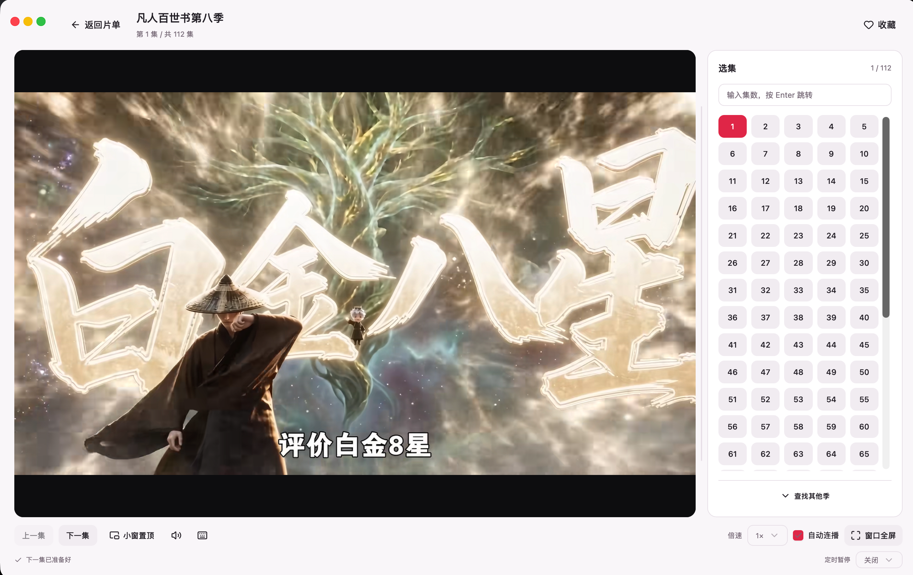

# 红果短剧 Mac 版

在 Mac 上找剧、收藏、接着上次看。**这是 macOS 版本，当前公开版本为 1.0.2，适用于 Apple 芯片（M 系列）Mac。**

[下载 Mac 安装包](https://github.com/nine-wolf/hongguo-mac-releases/releases/latest) · [安装教程](#安装教程) · [首次打开被拦截怎么办](#首次打开被拦截怎么办) · [反馈问题](https://github.com/nine-wolf/hongguo-mac-releases/issues)

**安装只需下载 [HongguoMac-1.0.2-arm64.dmg](https://github.com/nine-wolf/hongguo-mac-releases/releases/download/v1.0.2/HongguoMac-1.0.2-arm64.dmg)**。Python、Java 和播放组件已内置，无需安装安卓模拟器或额外运行环境。Release 中的 ZIP、tar.gz 和说明文件均不需要安装。

## 软件界面

### 发现短剧

### 播放与选集

截图中的剧集、封面与画面来自内容服务，具体内容及可用性以实际使用时为准。

## 支持的功能

- 浏览短剧、漫剧和 AI 短剧；搜索、分类筛选及滚动加载更多。
- 收藏与本机观看进度，支持继续观看；清理缓存后自动重新准备视频，支持重试。
- 选集、指定集数跳转、倍速、音量记忆和自动连播。
- 默认开启“播放完成后自动删除缓存”，只清理已播完的一集，保留收藏、进度和下一集预加载；可在设置中关闭。
- 自动选择片源提供的最高分辨率，不设 1080p 上限；提前准备下一集，减少切换等待。
- 窗口内全屏、小窗置顶、定时暂停和播放快捷键。
- 视频悬停时只显示播放控件，画面不覆盖阴影；顶部无原生亮线，支持拖动窗口。
- 可拖拽调整选集栏宽度，手动查找其他季并核对标题、季数和版本。
- 浅色、深色、暖色及跟随系统主题，中文和英文界面。

实际清晰度取决于片源；首次准备或预加载尚未完成时仍可能等待。收藏与观看进度保存在当前 Mac，不与手机账号同步。

## 安装教程

**设备要求：** Apple 芯片（M 系列）Mac，macOS 26 或更高。当前在 macOS 26.5.2 上完成测试；Intel Mac 暂无安装包，其他系统版本尚未逐一验证。

1. 进入 [Releases 下载页](https://github.com/nine-wolf/hongguo-mac-releases/releases/latest)，下载 `HongguoMac-1.0.2-arm64.dmg`。
2. 双击打开 DMG，将 **“红果 Mac”拖到“Applications（应用程序）”**。
3. 从“应用程序”打开“红果 Mac”，等待本机播放服务启动，即可浏览或搜索剧名。

需要联网获取片单和播放内容。安装后可推出 DMG 磁盘镜像，日常从“应用程序”启动。

更新时先退出旧窗口或按 `Command + Q`，再将新应用拖入“应用程序”并选择替换；无需删除收藏、观看记录或设置。

### 首次打开被拦截怎么办

本版本使用本地临时代码签名，**未使用 Apple Developer ID 签名，也未经过 Apple 公证**。首次打开可能提示“无法验证开发者”或“Apple 无法检查是否包含恶意软件”。

确认安装包来自本仓库且未被修改后，可按以下步骤对这个应用允许打开：

1. 先在“应用程序”中尝试打开一次“红果 Mac”；若被拦截，关闭提示窗口。
2. 打开 **“系统设置 → 隐私与安全性”**，向下滚动到“安全性”区域。
3. 在“红果 Mac”的拦截提示旁点击 **“仍要打开”**，按系统要求使用密码或 Touch ID 确认。
4. 再次出现提示时点击 **“打开”**。以后通常可以直接启动。

步骤参考 [Apple 官方说明：在 Mac 上安全地打开 App](https://support.apple.com/zh-cn/102445)。无需关闭系统防护或修改全局安全设置。

如果显示“将损坏你的电脑”或“App 已损坏”，请先停止打开、重新下载并核对发布页的 SHA-256，按 Apple 官方说明处理；这类提示与普通的未公证提示不同。受管理的公司电脑可能限制“仍要打开”，请联系管理员。

## 简单使用说明

- 点击剧集卡片进入详情，再点击播放；当前进度自动保存在本机。
- 播放时按 `F` 或点“窗口全屏”，视频铺满当前应用窗口；按 `Esc` 恢复。
- 按 `P` 或点“小窗置顶”进入置顶窗口；按 `P`、`Esc` 或“返回大窗”恢复。
- 空格暂停/继续，左右方向键快退/快进，`M` 静音，`[` / `]` 切换上一集/下一集。
- 右侧“查找其他季”只展示主标题匹配的候选；核对完整标题、季数、版本及简介后选择。未标季数的同名条目可能是起始部分，仍需核对内容。等待切换时可点“收起其他季”取消。
- “设置与帮助”可调整主题、语言和播放设置，清理视频缓存，查看快捷键。

收藏、观看记录和设置保存于 `~/Library/Application Support/HongguoMac/`。清理视频缓存不会删除收藏或观看记录。默认在单集播放完成后删除该集缓存；再次观看时会重新获取。当前按集准备视频，仅获取当前集和按需预加载的下一集，不会下载整部剧。

## 来源说明

本项目由 [nine-wolf](https://github.com/nine-wolf) 发布，是基于**渠道有数**维护的 [红果 Windows 发行项目](https://github.com/waligoraamodio288-rgb/hongguo-desktop-releases)独立适配的 **Mac 版本**，非红果官方，也非原 Windows 维护者发布的 Mac 版。

## ⚠️ 免责声明

1. 本项目是**个人自研的第三方适配版本**，与字节跳动 / 红果短剧官方无任何关系；"红果短剧"名称、logo 及全部剧集内容版权归原权利方所有，本项目仅作描述性使用。
2. 仅供个人学习研究，**请勿用于商业用途**，请勿二次分发打包产物，请勿公开传播。
3. 接口与内容可用性取决于第三方服务，**随时可能失效**；使用产生的全部风险由使用者自担。
4. 如权利方认为本项目侵犯权益，请提 Issue，将第一时间配合处理（下架 / 转私有）。

## 关于本仓库

本仓库用于 **Mac 安装包发行、安装说明和问题反馈**，Git 仓库只包含 README、截图和反馈模板，未上传本应用的开发项目源码，也不代表原 Windows 应用源码已开源。

Release 中几类附件的区别：

- **DMG**：Mac 安装包，普通用户只需下载这个文件。
- **INSTALL / SHA256SUMS / THIRD-PARTY-NOTICES**：安装说明、文件校验值及第三方组件说明，按需查阅。
- **third-party-sources.zip**：Java、FFmpeg 等第三方运行组件的配套源码、许可及构建说明，**不是本应用的开发项目源码，也不是安装器**。为保留内置组件所需的源码提供方式而提供；1.0.2 沿用相同运行组件，配套资料可从 [1.0.0 附件](https://github.com/nine-wolf/hongguo-mac-releases/releases/download/v1.0.0/HongguoMac-1.0.0-third-party-sources.zip)获取，安装时无需下载。
- **Source code (zip) / Source code (tar.gz)**：GitHub 自动生成的发行标签仓库归档，内容只有当时的 README、截图和反馈模板，**没有本应用的开发项目源码**。[GitHub 官方说明](https://docs.github.com/en/repositories/releasing-projects-on-github/about-releases)

第三方组件的版权、许可与来源保留在应用包内，各组件适用各自的许可证。`HongguoMac-1.0.2-SHA256SUMS.txt` 用于核对文件一致性，SHA-256 摘要不能代替发布者身份认证。

遇到问题请 [提交 Issue](https://github.com/nine-wolf/hongguo-mac-releases/issues)，注明 Mac 芯片、macOS 版本、软件版本、操作步骤和提示内容。截图请遮住无关个人信息，无需提供账号凭证或私人观看记录。
